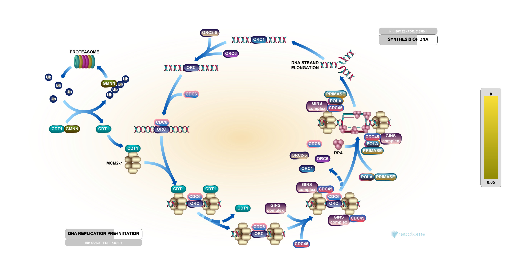
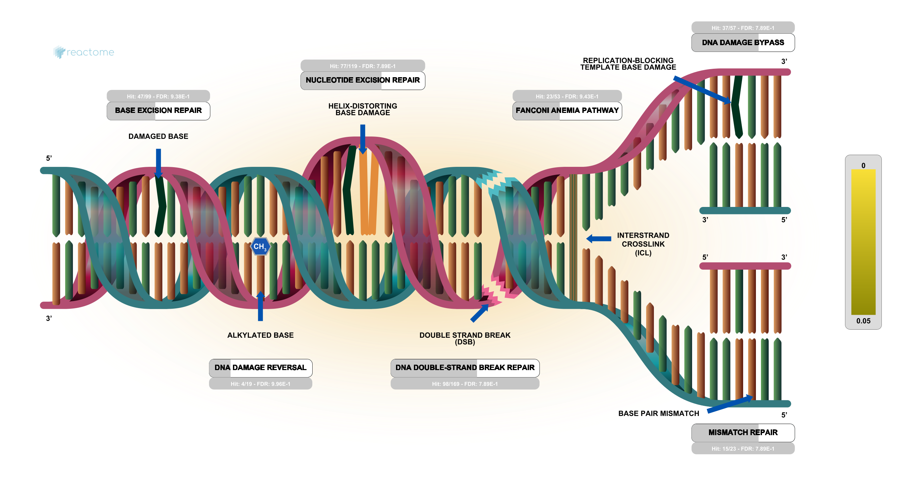

# Class 14
Hsiang-Ying Lu (PID: A15608316)

- [Data Import](#data-import)
- [Data Tidying](#data-tidying)
- [DESeq setup and analysis](#deseq-setup-and-analysis)
- [Side-note: QC with PCA](#side-note-qc-with-pca)
- [Add annotation data](#add-annotation-data)
- [Save my results](#save-my-results)
- [Visualization](#visualization)
- [Geneset enrichmen/Pathway
  analysis](#geneset-enrichmenpathway-analysis)
  - [Gene Ontology](#gene-ontology)
  - [Reactome](#reactome)

# Data Import

``` r
library(DESeq2)
```

    Loading required package: S4Vectors

    Loading required package: stats4

    Loading required package: BiocGenerics


    Attaching package: 'BiocGenerics'

    The following objects are masked from 'package:stats':

        IQR, mad, sd, var, xtabs

    The following objects are masked from 'package:base':

        anyDuplicated, aperm, append, as.data.frame, basename, cbind,
        colnames, dirname, do.call, duplicated, eval, evalq, Filter, Find,
        get, grep, grepl, intersect, is.unsorted, lapply, Map, mapply,
        match, mget, order, paste, pmax, pmax.int, pmin, pmin.int,
        Position, rank, rbind, Reduce, rownames, sapply, setdiff, sort,
        table, tapply, union, unique, unsplit, which.max, which.min


    Attaching package: 'S4Vectors'

    The following object is masked from 'package:utils':

        findMatches

    The following objects are masked from 'package:base':

        expand.grid, I, unname

    Loading required package: IRanges

    Loading required package: GenomicRanges

    Loading required package: GenomeInfoDb

    Warning: package 'GenomeInfoDb' was built under R version 4.3.2

    Loading required package: SummarizedExperiment

    Warning: package 'SummarizedExperiment' was built under R version 4.3.2

    Loading required package: MatrixGenerics

    Loading required package: matrixStats


    Attaching package: 'MatrixGenerics'

    The following objects are masked from 'package:matrixStats':

        colAlls, colAnyNAs, colAnys, colAvgsPerRowSet, colCollapse,
        colCounts, colCummaxs, colCummins, colCumprods, colCumsums,
        colDiffs, colIQRDiffs, colIQRs, colLogSumExps, colMadDiffs,
        colMads, colMaxs, colMeans2, colMedians, colMins, colOrderStats,
        colProds, colQuantiles, colRanges, colRanks, colSdDiffs, colSds,
        colSums2, colTabulates, colVarDiffs, colVars, colWeightedMads,
        colWeightedMeans, colWeightedMedians, colWeightedSds,
        colWeightedVars, rowAlls, rowAnyNAs, rowAnys, rowAvgsPerColSet,
        rowCollapse, rowCounts, rowCummaxs, rowCummins, rowCumprods,
        rowCumsums, rowDiffs, rowIQRDiffs, rowIQRs, rowLogSumExps,
        rowMadDiffs, rowMads, rowMaxs, rowMeans2, rowMedians, rowMins,
        rowOrderStats, rowProds, rowQuantiles, rowRanges, rowRanks,
        rowSdDiffs, rowSds, rowSums2, rowTabulates, rowVarDiffs, rowVars,
        rowWeightedMads, rowWeightedMeans, rowWeightedMedians,
        rowWeightedSds, rowWeightedVars

    Loading required package: Biobase

    Welcome to Bioconductor

        Vignettes contain introductory material; view with
        'browseVignettes()'. To cite Bioconductor, see
        'citation("Biobase")', and for packages 'citation("pkgname")'.


    Attaching package: 'Biobase'

    The following object is masked from 'package:MatrixGenerics':

        rowMedians

    The following objects are masked from 'package:matrixStats':

        anyMissing, rowMedians

``` r
metaFile <- "GSE37704_metadata.csv"
countFile <- "GSE37704_featurecounts.csv"

# Import metadata and take a peak
metadata = read.csv(metaFile, row.names=1)
head(metadata)
```

                  condition
    SRR493366 control_sirna
    SRR493367 control_sirna
    SRR493368 control_sirna
    SRR493369      hoxa1_kd
    SRR493370      hoxa1_kd
    SRR493371      hoxa1_kd

Have a wee peak at these objects

``` r
# Import countdata
counts = read.csv(countFile, row.names=1)
head(counts)
```

                    length SRR493366 SRR493367 SRR493368 SRR493369 SRR493370
    ENSG00000186092    918         0         0         0         0         0
    ENSG00000279928    718         0         0         0         0         0
    ENSG00000279457   1982        23        28        29        29        28
    ENSG00000278566    939         0         0         0         0         0
    ENSG00000273547    939         0         0         0         0         0
    ENSG00000187634   3214       124       123       205       207       212
                    SRR493371
    ENSG00000186092         0
    ENSG00000279928         0
    ENSG00000279457        46
    ENSG00000278566         0
    ENSG00000273547         0
    ENSG00000187634       258

# Data Tidying

I need to get rid of the first `length` column in `counts:`

``` r
counts <- counts[,-1]
```

Remove any genes with zero counts in all samples/columns

> Q. How many genes do we have to start with?

``` r
nrow(counts)
```

    [1] 19808

- FInd the rowSums() this will be zero for any genes with no data
- Find the zero sum genes
- Remove them before doing our DESeq

``` r
to.rm.ind <- rowSums(counts) == 0
counts <- counts[!to.rm.ind,]
nrow(counts)
```

    [1] 15975

# DESeq setup and analysis

``` r
library(DESeq2)
```

``` r
dds <- DESeqDataSetFromMatrix(countData = counts,
                              colData = metadata,
                              design = ~condition)
```

    Warning in DESeqDataSet(se, design = design, ignoreRank): some variables in
    design formula are characters, converting to factors

Now run our main DESeq analysis

``` r
#1 message: false
dds <- DESeq(dds)
```

    estimating size factors

    estimating dispersions

    gene-wise dispersion estimates

    mean-dispersion relationship

    final dispersion estimates

    fitting model and testing

``` r
res <- results(dds)
head(res)
```

    log2 fold change (MLE): condition hoxa1 kd vs control sirna 
    Wald test p-value: condition hoxa1 kd vs control sirna 
    DataFrame with 6 rows and 6 columns
                     baseMean log2FoldChange     lfcSE       stat      pvalue
                    <numeric>      <numeric> <numeric>  <numeric>   <numeric>
    ENSG00000279457   29.9136      0.1792571 0.3248216   0.551863 5.81042e-01
    ENSG00000187634  183.2296      0.4264571 0.1402658   3.040350 2.36304e-03
    ENSG00000188976 1651.1881     -0.6927205 0.0548465 -12.630158 1.43989e-36
    ENSG00000187961  209.6379      0.7297556 0.1318599   5.534326 3.12428e-08
    ENSG00000187583   47.2551      0.0405765 0.2718928   0.149237 8.81366e-01
    ENSG00000187642   11.9798      0.5428105 0.5215599   1.040744 2.97994e-01
                           padj
                      <numeric>
    ENSG00000279457 6.86555e-01
    ENSG00000187634 5.15718e-03
    ENSG00000188976 1.76549e-35
    ENSG00000187961 1.13413e-07
    ENSG00000187583 9.19031e-01
    ENSG00000187642 4.03379e-01

# Side-note: QC with PCA

``` r
pc <- prcomp(t(counts),scale=T)
```

``` r
summary(pc)
```

    Importance of components:
                               PC1     PC2      PC3      PC4      PC5       PC6
    Standard deviation     87.7211 73.3196 32.89604 31.15094 29.18417 7.387e-13
    Proportion of Variance  0.4817  0.3365  0.06774  0.06074  0.05332 0.000e+00
    Cumulative Proportion   0.4817  0.8182  0.88594  0.94668  1.00000 1.000e+00

``` r
plot(pc$x[,1],pc$x[,2], col=as.factor(metadata$condition), pch=15)
```


# Add annotation data

# Save my results

# Visualization

``` r
plot(res$log2FoldChange, -log(res$padj))
```


``` r
# Make a color vector for all genes
mycols <- rep("gray", nrow(res) )

# Color red the genes with absolute fold change above 2
mycols[ abs(res$log2FoldChange) > 2 ] <- "red"

# Color blue those with adjusted p-value less than 0.01
#  and absolute fold change more than 2
inds <- (res$pvalue<0.01) & (abs(res$log2FoldChange) > 2 )
mycols[ inds ] <- "blue"

plot( res$log2FoldChange, -log(res$padj), col=mycols, xlab="Log2(FoldChange)", ylab="-Log(P-value)" )
```


Let’s add some color and annotation data to this plot.

``` r
library("AnnotationDbi")
library("org.Hs.eg.db")
```

``` r
columns(org.Hs.eg.db)
```

     [1] "ACCNUM"       "ALIAS"        "ENSEMBL"      "ENSEMBLPROT"  "ENSEMBLTRANS"
     [6] "ENTREZID"     "ENZYME"       "EVIDENCE"     "EVIDENCEALL"  "GENENAME"    
    [11] "GENETYPE"     "GO"           "GOALL"        "IPI"          "MAP"         
    [16] "OMIM"         "ONTOLOGY"     "ONTOLOGYALL"  "PATH"         "PFAM"        
    [21] "PMID"         "PROSITE"      "REFSEQ"       "SYMBOL"       "UCSCKG"      
    [26] "UNIPROT"     

``` r
head(row.names(counts))
```

    [1] "ENSG00000279457" "ENSG00000187634" "ENSG00000188976" "ENSG00000187961"
    [5] "ENSG00000187583" "ENSG00000187642"

``` r
res$symbol <- mapIds(org.Hs.eg.db,
                     keys=row.names(counts),
                     keytype = "ENSEMBL",
                     column = "SYMBOL",
                     multiVals="first")
```

    'select()' returned 1:many mapping between keys and columns

``` r
res$entrez <- mapIds(org.Hs.eg.db,
                     keys=row.names(counts),
                     keytype = "ENSEMBL",
                     column = "ENTREZID",
                     multiVals="first")
```

    'select()' returned 1:many mapping between keys and columns

``` r
head(res)
```

    log2 fold change (MLE): condition hoxa1 kd vs control sirna 
    Wald test p-value: condition hoxa1 kd vs control sirna 
    DataFrame with 6 rows and 8 columns
                     baseMean log2FoldChange     lfcSE       stat      pvalue
                    <numeric>      <numeric> <numeric>  <numeric>   <numeric>
    ENSG00000279457   29.9136      0.1792571 0.3248216   0.551863 5.81042e-01
    ENSG00000187634  183.2296      0.4264571 0.1402658   3.040350 2.36304e-03
    ENSG00000188976 1651.1881     -0.6927205 0.0548465 -12.630158 1.43989e-36
    ENSG00000187961  209.6379      0.7297556 0.1318599   5.534326 3.12428e-08
    ENSG00000187583   47.2551      0.0405765 0.2718928   0.149237 8.81366e-01
    ENSG00000187642   11.9798      0.5428105 0.5215599   1.040744 2.97994e-01
                           padj      symbol      entrez
                      <numeric> <character> <character>
    ENSG00000279457 6.86555e-01          NA          NA
    ENSG00000187634 5.15718e-03      SAMD11      148398
    ENSG00000188976 1.76549e-35       NOC2L       26155
    ENSG00000187961 1.13413e-07      KLHL17      339451
    ENSG00000187583 9.19031e-01     PLEKHN1       84069
    ENSG00000187642 4.03379e-01       PERM1       84808

# Geneset enrichmen/Pathway analysis

``` r
library(gage)
```

``` r
library(gageData)
library(pathview)
```

    ##############################################################################
    Pathview is an open source software package distributed under GNU General
    Public License version 3 (GPLv3). Details of GPLv3 is available at
    http://www.gnu.org/licenses/gpl-3.0.html. Particullary, users are required to
    formally cite the original Pathview paper (not just mention it) in publications
    or products. For details, do citation("pathview") within R.

    The pathview downloads and uses KEGG data. Non-academic uses may require a KEGG
    license agreement (details at http://www.kegg.jp/kegg/legal.html).
    ##############################################################################

The `gage()` function wants a “vector of importance” in our case here it
will be fold-change values with associated entrez gene names.

``` r
foldchange <- res$log2FoldChange
names(foldchange) <- res$entrez
```

``` r
data(kegg.sets.hs)
# Get the results
keggres = gage(foldchange, gsets=kegg.sets.hs)
```

``` r
head(keggres$less)
```

                                                      p.geomean stat.mean
    hsa04110 Cell cycle                            8.995727e-06 -4.378644
    hsa03030 DNA replication                       9.424076e-05 -3.951803
    hsa05130 Pathogenic Escherichia coli infection 1.405864e-04 -3.765330
    hsa03013 RNA transport                         1.246882e-03 -3.059466
    hsa03440 Homologous recombination              3.066756e-03 -2.852899
    hsa04114 Oocyte meiosis                        3.784520e-03 -2.698128
                                                          p.val       q.val
    hsa04110 Cell cycle                            8.995727e-06 0.001889103
    hsa03030 DNA replication                       9.424076e-05 0.009841047
    hsa05130 Pathogenic Escherichia coli infection 1.405864e-04 0.009841047
    hsa03013 RNA transport                         1.246882e-03 0.065461279
    hsa03440 Homologous recombination              3.066756e-03 0.128803765
    hsa04114 Oocyte meiosis                        3.784520e-03 0.132458191
                                                   set.size         exp1
    hsa04110 Cell cycle                                 121 8.995727e-06
    hsa03030 DNA replication                             36 9.424076e-05
    hsa05130 Pathogenic Escherichia coli infection       53 1.405864e-04
    hsa03013 RNA transport                              144 1.246882e-03
    hsa03440 Homologous recombination                    28 3.066756e-03
    hsa04114 Oocyte meiosis                             102 3.784520e-03

hsa04110 cell cycle

``` r
pathview(gene.data=foldchange, pathway.id="hsa04110")
```

    'select()' returned 1:1 mapping between keys and columns

    Info: Working in directory /Users/sophialu1999/Desktop/UCSD Biological Sciences Ph.D./BGGN213-Bioinformatics/Class 15/BGGN213 Class 15/Class 14

    Info: Writing image file hsa04110.pathview.png

Have a look at my figure ([Figure 1](#fig-cellcycle))


## Gene Ontology

``` r
data(go.sets.hs)
data(go.subs.hs)
# Focus on Biological Process subset of GO
gobpsets = go.sets.hs[go.subs.hs$BP]

gobpres = gage(foldchange, gsets=gobpsets, same.dir=TRUE)
```

``` r
head(gobpres$less)
```

                                                p.geomean stat.mean        p.val
    GO:0048285 organelle fission             1.536227e-15 -8.063910 1.536227e-15
    GO:0000280 nuclear division              4.286961e-15 -7.939217 4.286961e-15
    GO:0007067 mitosis                       4.286961e-15 -7.939217 4.286961e-15
    GO:0000087 M phase of mitotic cell cycle 1.169934e-14 -7.797496 1.169934e-14
    GO:0007059 chromosome segregation        2.028624e-11 -6.878340 2.028624e-11
    GO:0000236 mitotic prometaphase          1.729553e-10 -6.695966 1.729553e-10
                                                    q.val set.size         exp1
    GO:0048285 organelle fission             5.843127e-12      376 1.536227e-15
    GO:0000280 nuclear division              5.843127e-12      352 4.286961e-15
    GO:0007067 mitosis                       5.843127e-12      352 4.286961e-15
    GO:0000087 M phase of mitotic cell cycle 1.195965e-11      362 1.169934e-14
    GO:0007059 chromosome segregation        1.659009e-08      142 2.028624e-11
    GO:0000236 mitotic prometaphase          1.178690e-07       84 1.729553e-10

## Reactome

We will use the online version of Reactome. It wants a list of your
genes. We will write ths out from R here:

``` r
sig_genes <- res[res$padj <= 0.05 & !is.na(res$padj), "symbol"]

write.table(sig_genes, 
            file="significant_genes.txt", row.names=FALSE, col.names=FALSE, quote=FALSE)
```

Reactome website: https://reactome.org/PathwayBrowser/#TOOL=AT

 
